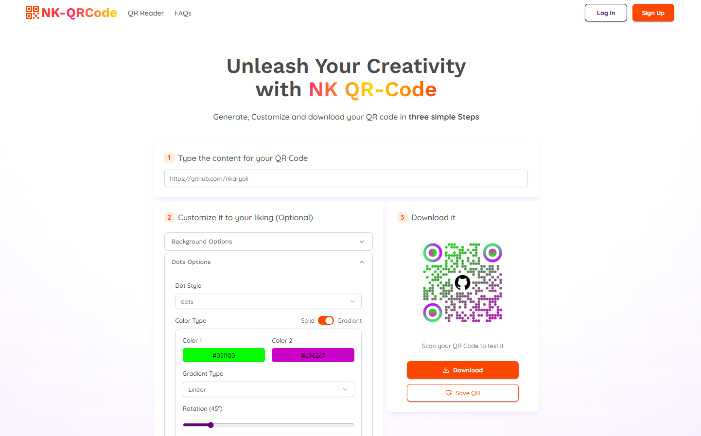
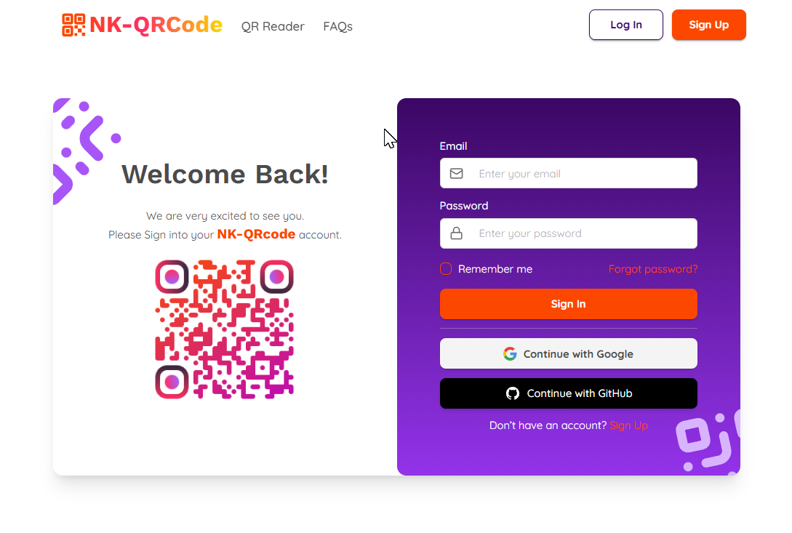
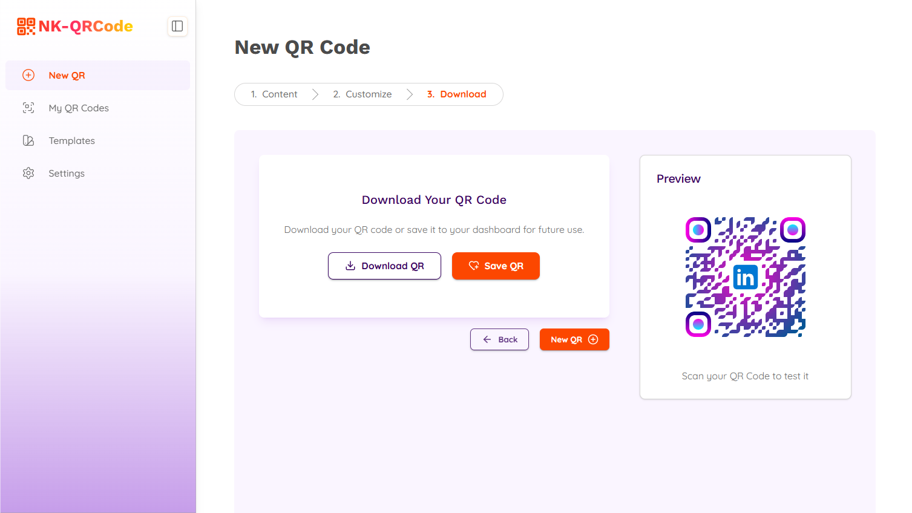
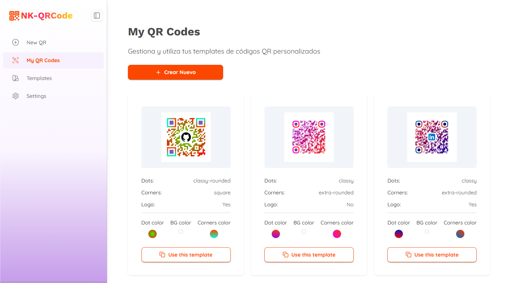

# NK QR Code

A modern **QR code generator and customizer** built with **React**, **TypeScript**, and **Tailwind CSS**.  
Create beautiful and functional QR codes for links, text, contacts, or any custom data — all with live preview and export options.

---

## 🚀 Demo

👉 [Live Demo](https://nk-qr-code.vercel.app)  
*(or replace this link with your actual deployed version)*

---

## ✨ Features

- Generate QR codes for:
  - URLs, text, email, phone numbers, etc.
- Full customization:
  - Foreground and background colors.
  - Size and margin adjustments.
  - Rounded or square modules.
  - Optional embedded logo or icon.
- Download your QR in **PNG** or **SVG**.
- Clean and responsive UI with **Tailwind CSS**.
- Built with **Vite** for lightning-fast development.

---

## 🛠️ Tech Stack

- **React + TypeScript** — component-based UI
- **Tailwind CSS** — utility-first styling
- **Shadcn** — customizable components 
- **Vite** — fast bundling and dev server
- **qr-code-styling** — QR code generation
- **Supabase** — BBDD

---

## 📦 Installation

```bash
# Clone the repository
git clone https://github.com/nkaryoli/nk_qrCode.git

# Navigate into the project
cd nk_qrCode

# Install dependencies (using pnpm, npm, or yarn)
pnpm install

# Start the development server
pnpm dev

Then open http://localhost:5173 in your browser.
```
## 🧠 Key Concepts

- Custom QR rendering — Users can preview style changes in real time.

- Type-safe logic — Written fully in TypeScript.

- Accessible and responsive — Designed for usability across devices.

- Modular architecture — Organized by feature for scalability.

## 📸 Screenshots

### Home Page with customization Panel


### Different LogIn Options


### Download and save Options


### Easy access to saved QRs


## 🧑‍💻 Author

Nkaryoli
GitHub
 • LinkedIn [KaryoliNieves](https://www.linkedin.com/in/karyoli-nieves/)
 • Portfolio [karyoliNieves.com](https://nkaryoli.github.io/miPortfolio/)

## 🪪 License

This project is licensed under the MIT License.

## 📞 Contacto

📧 Email: karyoli.ie@gmail.com

⭐ ¿Te gusta NK-qrCode? ¡Dale una estrella en GitHub!
